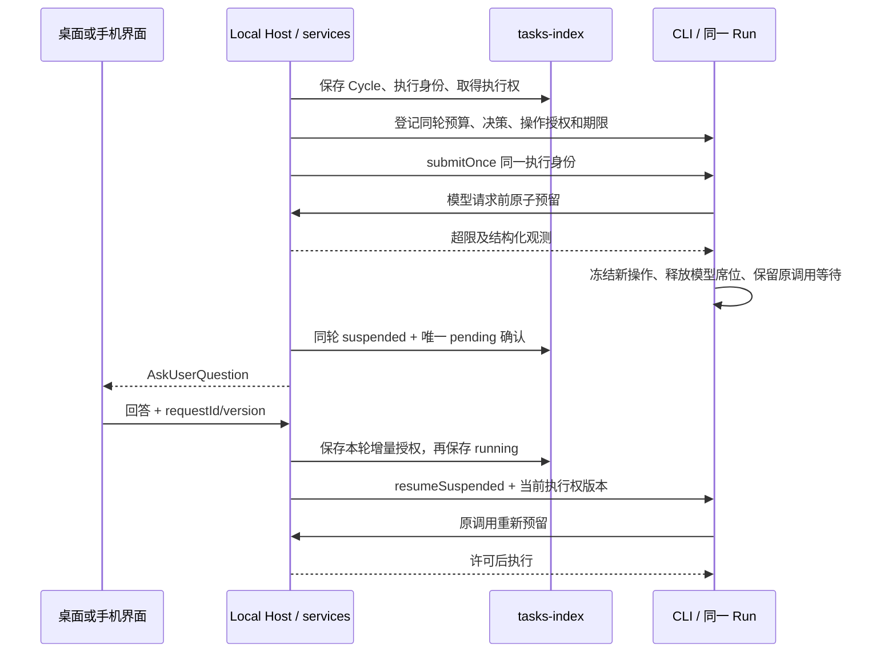

# Continuous 发布遗留问题与下一步 Ticket

日期：2026-10-05。来源：[发布记录 §2.1](../release/continuous.md)、[产品规格](../specs/continuous.md)。
目标：将已实现的模块接成真实产品，保留同 Cycle/Run 暂停与继续，取得可复查的桌面、手机与真模型证据。

## 固定产品规则

不再重新讨论已确认的产品选择：最多 10 个 actor 并发、一个 builder；单轮 10 亿 token、估算 USD 100、每日估算 USD 1000；有效执行一小时。达到资源上限暂停并询问用户，同轮授权增加额度；unknown 用量仍占预算。有责任方、原因和实际期限的正常阻塞不计有效时间。15 秒主动探测，180 秒无进展且连续 3 次无法证明健康才询问是否继续。

只开放本地 workspace。交付到独立分支/worktree，验证通过后自动本地提交，用户手动合并；不自动 push、创建 PR、merge 或 deploy。应用退出停止，重启先核对未结束轮，再调度未来轮。预算暂停确认与产品 Decision Queue 分开，独立候选可以继续。

## 已完成的接缝修复

| 事项               | 实施与证据                                                                                                      | 结论范围                                                    |
| ------------------ | --------------------------------------------------------------------------------------------------------------- | ----------------------------------------------------------- |
| 预算等待           | `continuous-model-budget.ts`、`continuous-suspension.ts`；真实 DWF 预算等待、授权继续、退出 interrupted 测试    | 引擎接缝完成，Host 确认通信未装配                           |
| 操作检查           | `continuous-io-guards.ts`、actor factory、child runtime 与 run world 端口；真实文件写入/删除/链接和拒绝命令测试 | 有实际执行点；命令、提交、递归搜索尚未开放                  |
| 探活调用与进展证据 | supervisorWatch、supervisorHealth、journal 证据读取；真实 SQLite 有效时间暂停与状态竞态测试                     | 同一监督循环有调用；等待类型尚需扩充                        |
| 原子健康更新       | repository `updateCycleHealth`，同 running 状态及 leaseEpoch 条件，仅更新健康列                                 | 不改变数据库结构；取消状态/游标不被覆盖                     |
| 登记缺项拒绝       | managed submit、resume、continue 核对预算/暂停/决策/IO 登记及实际 cwd                                           | 启动检查完成；登记内容仍需 Host 创建和恢复                  |
| 退出中断           | 严格 wire 契约 `interrupt(ref, epoch)`，取消原因 interrupted，等待工具收尾                                      | 真实引擎预算等待可退出；退出中的暂停确认必须由产品 E2E 验证 |

## 所有者与执行顺序

Program/Cycle、预算、确认、队列与执行权由 Local Host 的 services/repository 保存。CLI 只保存实际 Run、journal、当前准入守卫和可取消等待。Renderer 保留草稿和展示状态；Main、scheduler 与 relay 不保存另一份任务事实。

桌面实时链路与手机可重放链路共享这个所有者。手机断线补 snapshot/sequence，不能创建第二个 CLI、Host 或 Run。

## CT-11：补齐安全操作与可信验证（P0，先做）

修改边界：CLI bootstrap 的受管 IO adapter、现有执行 adapter、services 的候选授权/验证与 workspace 端口、受信 Continuous 模板；不改普通 Workflow 的默认能力。

实施：

1. 提供受限递归搜索，逐个实际目标检查 Scope、forbidden、protected 和链接目标；不能先读全目录再仅过滤文件名。允许路径的上级目录只用于导航，不因此获得其余文件读取权限。
2. 对文件检查后替换 symlink 的竞态补充实际隔离证明与回归。静态 realpath 检查不能被描述成完整沙箱。
3. 声明测试由受控 argv 端口执行，固定 worktree cwd、环境、超时、输出目录和取消过程；实际限制文件/网络副作用。缺少可信隔离实现继续返回不可用，不能把 request.sandbox.enabled 当证明。
4. 测试退出码、输出、Git diff、文件/行数和浏览器 390/1280 证据由工具端口产生并关联 candidate/run/epoch。模型返回 `exitCode: 0` 或 `passed` 只算报告，不能授权提交。
5. 本地提交由可信 workspace/提交端口执行，检查实际授权路径与三阶段验证结果。受管模板移除直接 `world.run git add/commit` 路径；actor 无任意 Git 写能力。提交前复查 working tree 和证据，失败保留用户改动并记录未验证。
6. 支持达文件/行数上限时暂停同轮，继续只增加本轮额度；候选被 Decision 推迟立即撤销写许可。

验收：真实 IO 拒绝有零副作用证据；只读角色不能写；原仓库不改；未授权/失效候选拒绝；命令无法改原仓库或越界网络写入；停止后整棵进程树退出；缺任何验证都不能提交；成功只在 Program 分支产生本地提交。新增绕过测试必须先失败再修复。

## CT-12：装配 window-scoped Local Host（P0，依赖 CT-11）

修改边界：桌面已有 Local Host 生命周期、services 注入与 channel 注册、scheduler Continuous wake router、CLI 的受管配置；不用 Main 保存业务状态。

实施：构造 repository、supervisor、recovery、预算、继续确认与模板来源，注册 `ServiceChannels.Continuous` 和 wake handler。只复用窗口现有 Local Host。以 `workspaceIdentity?.trim() || workspacePath` 关联所有轮和预算；操作 cwd 使用 workspacePath/受管 worktree。

登记使用 shared 的严格传输协议，由 CLI 在本进程构造预算/决策/IO 端口与按 Run ID 的登记；Host 不导入 Runtime，也不尝试跨 stdio 传函数。增加专用登记命令和 CLI→Host 的预留、结算、拒绝通知/决策请求，将价格快照、请求输入/输出上限、冻结配置、角色和执行权版本一并校验。模型预算与 IO 都绑定 CLI 执行适配器同一准入。只有这些操作完整受支持才开放 capability。10 并发上限来自冻结配置并传入引擎 caps，不能退回 CPU 默认值。

启动顺序固定为：保存执行身份 → 取得执行权 → 按 Run ID 登记预算、共享准入、决策、角色授权和真实工作目录 → submitOnce。重发同触发键不新建 Cycle/Run。恢复前从持久化快照重建全部登记；登记失败、CLI 太旧或未验证平台时不给自主实施 capability。新 interrupt 操作也必须参加 CLI 能力协商。

执行权版本、有效期贯穿预算/写入/提交；断联和旧 owner 禁止副作用。退出先停止新 wake，保存 interrupted/保留 suspended 确认，interrupt 并等待工具收尾；不能把只冻结后永远等待 Run 结束当退出流程。重新启动先处理旧 Cycle，正常预算暂停未经回答保持暂停。

验收：真实 UI capability 确认可用；仅一个 Host/执行权/Run；原路径和远程同路径不会串任务；旧 epoch 无副作用；退出与重启同轮恢复；功能关闭、旧库与普通 Workflow/Automation 不受影响。

## CT-13：预算与 AskUserQuestion 的真实通信（P0，依赖 CT-12）

实施：CLI 每次 provider 调用经 Host 原子预留；传输严格校验身份、执行权版本、价格版本和请求键。拒绝结果携带真实 limitKind、已用/预留/unknown、当前限额与本请求需求，不能只返回一段错误文字。

统一暂停路径先冻结 CLI 新模型/写操作，再保存同轮唯一确认。多个 actor 同时超限合并确认，不重复弹窗。原请求等待用户，释放并发席位。授权结果保存增量，不重置已用量；Host 保存 running 后解开 CLI 等待。重复回答、旧 version、仅日额度过期均不能自行扩额。停止/退出取消等待，保留未知预留。

单请求尝试上限也要有明确继续授权语义；价格缺失、账本断联和恢复超限需要结构化需关注原因，不能靠自动重试推进。旧版已经 errored 的预算轮显示不可恢复，允许用户结束旧轮、显式新开轮，保留账本和历史。

验收：达到单轮 token、单轮费用、日费用、改动量或有效时间分别暂停；停留 paused 不调用 provider；授权后原 Cycle/Run 继续；并发预留不超发；unknown 不清零；跨日、重复回答和用户结束均有真实数据库/调用计数证据。

## CT-14：完整主动探活和正常阻塞（P0，依赖 CT-12/13）

实施：保留 supervisor 同一监督循环的 15 秒 probeOnce；真实 journal 动作时刻是进展证据。模型重试 backoff 已支持；新增测试、工具等操作的实际等待登记，带 owner/run/epoch、原因、开始时刻、真实期限、取消与完成通知。只有全部正在执行的节点都在有效等待中才豁免整轮有效时间。

过期登记移除；查询/heartbeat 不刷新动作时刻。读取执行快照与报告必须有可诊断的通信期限，不能让监督循环永远卡在一次 RPC。失联冻结新操作、保留 interrupted 和证据，再由恢复核对；健康写入只更新同 epoch 的 running 行。

验收：两小时有效等待跨一小时墙钟仍继续；任一 actor 工作仍计有效时间；等待失效后重新计时；健康工作一小时暂停询问；180 秒无进展加 3 次失败探测触发 hang 确认；中途暂停/取消/执行权改变不被旧快照覆盖；重启不累计离线时间。

## CT-15：真实桌面与手机 E2E（P0，依赖 CT-11…14）

现有 `e2e.test.mjs` 多数业务 case 直接调用 blockedCase；Host 装配完成不会自动把这些 case 变成测试。必须逐项实现 UI 操作与事实断言，并修复当前窗口未就绪预检。当前 regression 的 E-28 导航断言失败，但 entryReport 漏记失败并显示 passed；修复要求每个失败 case 先保存 failed 和证据，统一报告必须与 Node 退出码一致，不能把故障改写为通过。

实施：沿现有统一 runner 创建隔离 home/数据库/Git 仓库和脚本模型；等待实际窗口/页面就绪，点击真实 UI，经产品命令和 CLI 执行，读取数据库、journal、provider 计数、进程与 Git 证明结果。允许测试时钟/故障注入，不允许向 UI store 直接塞目标状态来证明功能。

手机连接桌面已有 attachment；验证同身份输入、断线重连、缺口补发、重复回答、旧 epoch、桌面退出与恢复。生产构建不能暴露故障注入或测试桥。

验收：现有 E-01…E-20、E-24/E-28、E-29…E-34 及手机相关 case 都有真实动作和断言；无 planned；核心 case 无 blocked/skipped；输出截图、序号、执行身份、预算记录和断言。证据注明 base commit 与本次工作树差异，避免仅以旧 HEAD 代表未提交源码。

## CT-16：固定运行时、安装包与真实模型验收（P0，最后）

按 `mise.toml` 的 Node 版本要求（≥ 24）重跑类型检查、Lint 和全部自动 suite，并在验收记录中写明实际使用的 Node 版本，保证同一版本可复现。随后在真实打包 app 中重复暂停/退出/恢复/停止/本地提交。其他平台逐一取得真实机器证据才登记 autonomous。

live 走现有显式 `--allow-live` 入口，使用用户可用测试配置并遵守预算；分别验证真实 usage、compaction/sidecar、限流、unknown、无进展和同轮继续。没有配置则记录 blocked，不用模拟结果替代。

验收：必要 U/I/R/E 与普通功能回归通过；打包平台、手机和 live 完成；生产无测试接口。任何必要 blocked 都保留默认关闭。

## 实施顺序与交付

按 CT-11 → CT-12 → CT-13 → CT-14 → CT-15 → CT-16 执行。每张 ticket 先补 spec 和会失败的回归，再实现并记录真实验证。独立分支本地提交，用户手动合并；本计划不要求再次讨论产品默认值，也不授权提前开放未经验证的能力。
